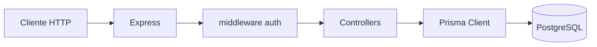

# Arquitetura do backend

## Stack

| Camada | Tecnologia |
|--------|------------|
| API | Node.js, Express |
| Auth | JWT (`Authorization: Bearer <token>`), bcrypt |
| Base de dados | PostgreSQL (Prisma) |

## Funções por perfil (resumo)

| Perfil | Rotas / funções |
|--------|-----------------|
| **Público** | `GET /health`, `GET /clinics`, `GET /clinics/:id`, `POST /auth/register` (só **paciente** com `clinicId`), `POST /auth/login` |
| **Qualquer autenticado** | `GET /me` |
| **Admin da clínica** (`CLINIC_ADMIN`) | `GET/PATCH /admin/clinic`, `POST/GET /admin/doctors`, `GET /admin/patients` |
| **Médico** (`DOCTOR`) | `GET /doctor/me`, `GET /doctor/patients` |
| **Paciente** (`PATIENT`) | `GET /patient/me`, `GET /patient/clinic` |

Tentativas de aceder a rotas de outro perfil → **403**. Detalhe das rotas: [API.md](API.md).

## Visão geral

Serviço **Express** com **Prisma** (PostgreSQL), **JWT** para sessão e **bcrypt** para hashes de palavra-passe. A aplicação Express é criada em `createApp()` para permitir testes com **Supertest** sem abrir porta.



## Estrutura de pastas

```
backend/
├── docs/              # Esta documentação
├── prisma/
│   ├── schema.prisma  # Modelos Clinic, User
│   └── seed.js
├── src/
│   ├── app.js         # Rotas e middleware Express
│   ├── server.js      # Entrada: listen(PORT)
│   ├── config.js      # PORT, JWT_SECRET
│   ├── db.js          # Instância PrismaClient
│   ├── controllers/   # auth, admin, doctor, patient, clínica pública
│   ├── middleware/    # requireAuth, requireRoles
│   └── utils/         # password, token, userDto
└── tests/
    └── integration.test.js
```

## Modelo de dados (resumo)

- **Clinic** — nome, cidade.
- **User** — e-mail único, hash de password, nome, `role`, `clinicId` opcional (obrigatório para os fluxos de clínica).

Relação: vários utilizadores pertencem a uma clínica (`User.clinicId` → `Clinic.id`).

## Fluxo de autenticação

1. `POST /auth/login` valida e-mail e password e devolve JWT com `sub` (user id), `role`, `clinicId`.
2. Pedidos subsequentes enviam `Authorization: Bearer <token>`.
3. `requireAuth` verifica o JWT e preenche `req.user`.
4. `requireRoles(...)` garante que apenas perfis permitidos acedem à rota.

## Extensão

- Novas rotas: registar em `src/app.js` e implementar em controller dedicado.
- Novos modelos: alterar `prisma/schema.prisma`, executar `prisma db push` (ou migrações em produção).
